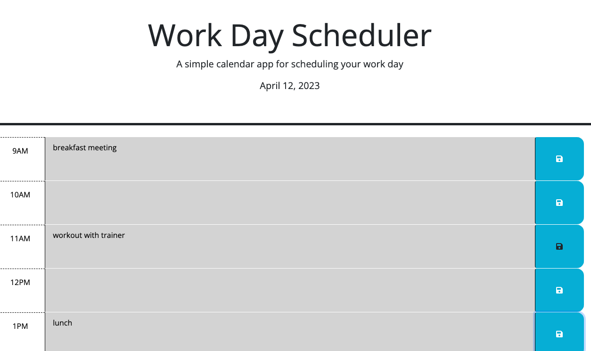

# Work Day Planner
A simple calendar application that allows a user to save events for each hour of the day

## Table of Contents

- [Overview](#overview)
- [Preview](#preview)
- [Deployed Link](#deployed-link)

## Overview

As a developer, I want to create a daily planner so that I can schedule tasks for a given day and see at glance what is coming up and what has already passed.
I want to have the day broken into hourly blocks that cover the work day (9am - 5pm).
I want the blocks to color coded to indicate the current hour, past hours and future hours.
I want to add new tasks or delete them from the blocks as needed.
I want the tasks to be stored so that they remain in the planner when the page is refreshed.

## Preview

## Deployed Link

[Link to planner](https://winstonheard.github.io/work-day-planner/) 